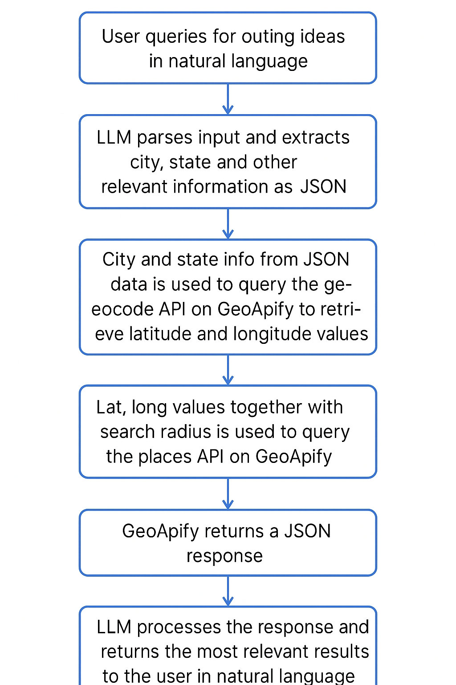

# Outing Planner
Python Fast-API application that uses GenAI to recommend outing plans based on user input.

App uses  free-tier models hosted on [openrouter.ai](https://openrouter.ai/)  to parse location info from user input and to generate natural language summaries from JSON data. 

The APIs on  [GeoApify](https://www.geoapify.com/) are leveraged to provide up to date places information for the user query.

## FlowChart



## Installation

### 1. Clone the repository
```
git clone https://github.com/smk-dev20/outing_planner.git
cd outing_planner
```
### 2. Dev Environment Setup
#### Setup a virtual environment - Unix/Linux
```
python3 -m venv .venv
source .venv/bin/activate
```

#### Setup a virtual environment - Windows - Command Prompt
```
python -m venv .venv
source .venv\Scripts\activate
```

#### Install dependencies
```
pip install -r requirements.txt
```
#### Generate API Keys
Sign up and generate API Keys for:
- [openrouter.ai](https://openrouter.ai/) 
- [GeoApify](https://www.geoapify.com/)
#### Setup Environment Variables
Create a .env file and configure OpenRouter and GeoApify credentials:
```
OPENROUTER_API_KEY="<your-openrouter-api-key>"
OPENROUTER_URL="https://openrouter.ai/api/v1/chat/completions"
OPENROUTER_*_MODEL="<your-choice-of-model/s>"
GEO_KEY="<your-geoapify-api-key>"
GEO_PLACES_URL="https://api.geoapify.com/v2/places"
GEO_CODE_URL="https://api.geoapify.com/v1/geocode/search"
GEO_CATEGORIES="leisure.park,leisure.park.garden,leisure.park.nature_reserve,national_park,entertainment.museum,entertainment.zoo,entertainment.aquarium,entertainment.planetarium"
GEO_CONDITIONS="wheelchair"
```

#### Run the application
```
python app/main.py
```

Application will start on http://localhost:8000

## APIS
```
URL: http://127.0.0.1:8000/plan_outing
Method: POST
Header: Content-Type: application/json
Body: {
  "text": "I am looking for county or state parks near San Jose California that are stroller friendly and have shaded spaces"
}

Expected Sample Response: 
{
  result : {
    "introduction": "Here are some parks near San Jose, California, that are stroller-friendly and have shaded spaces:",
    "places_summary": [
              {"name": "Nielsen Park", 
              "address": "3755, Pleasanton, California, United States of America", 
              "type": "State Park", 
              "description": "Stroller-friendly park with wheelchair access and shaded spaces.", 
              "website": "", 
              "phone": "", 
              "hours": ""}],
  "conclusion": "Enjoy your visit to these wonderful parks!"}
}

```